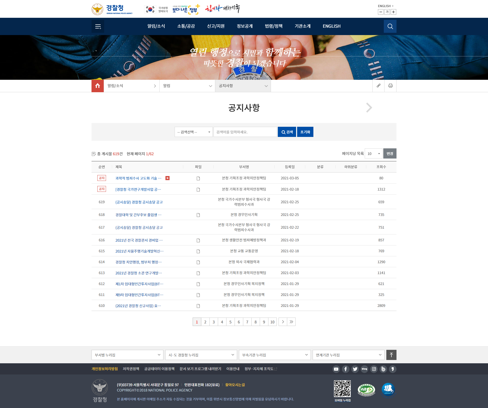
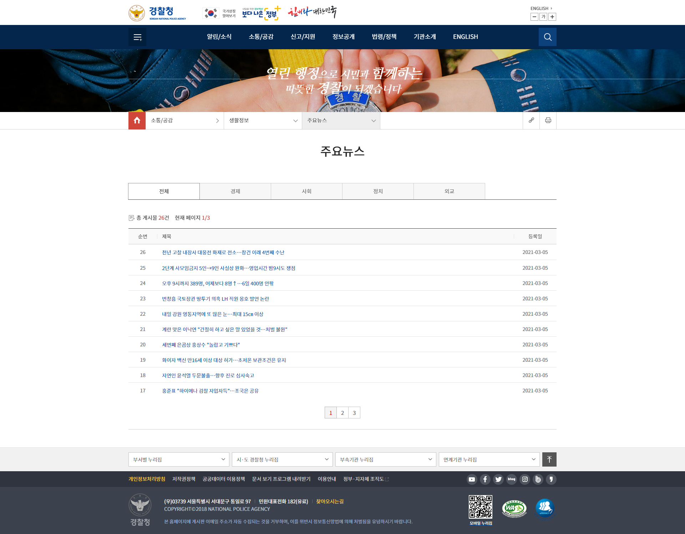
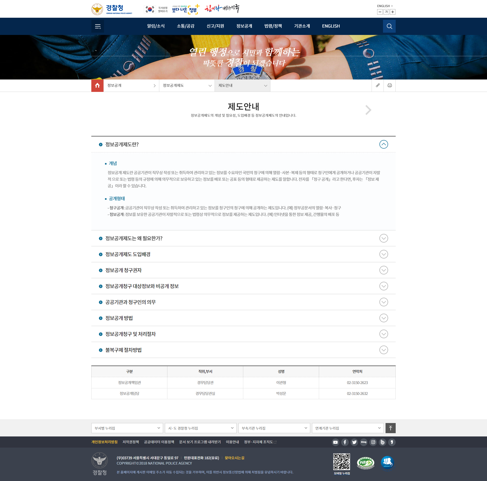
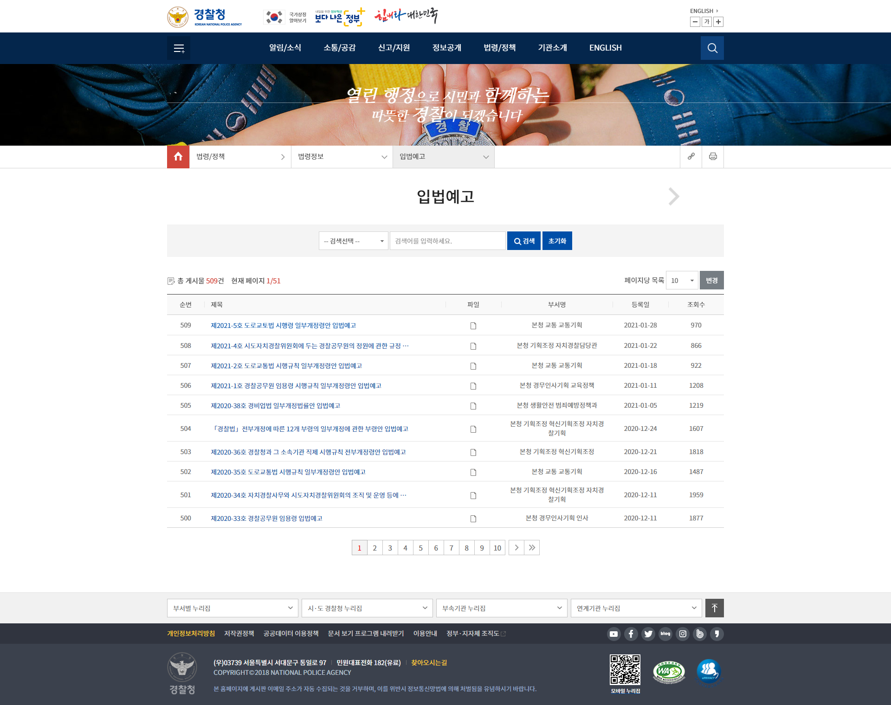

# police_agency_cloning
Korean National Police Agency web site code cloning

* Languages
  - HTML5 
  - CSS3 
  - Javascript (Jquery / Kakao map API)
   
* Supported Browsers
  - Chrome 
  - Firefox
  - IE 8~11 (In IE8, Javascript is not working)
  - ......

* Pages 
  - 1 main page
  - 8 sub pages : Including English page and Login page   
           
* Pages samples

------------------------------------------------------------------------------------

------------------------------------------------------------------------------------

------------------------------------------------------------------------------------

  

