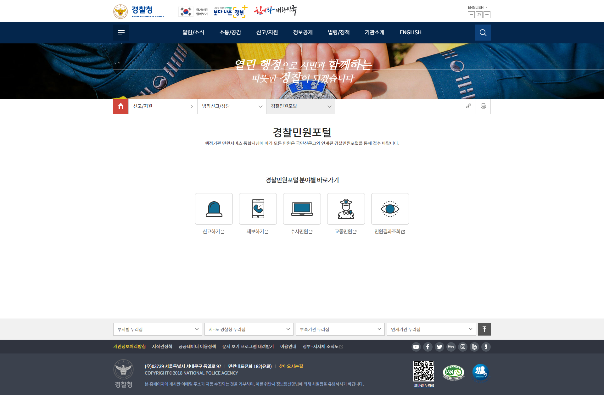
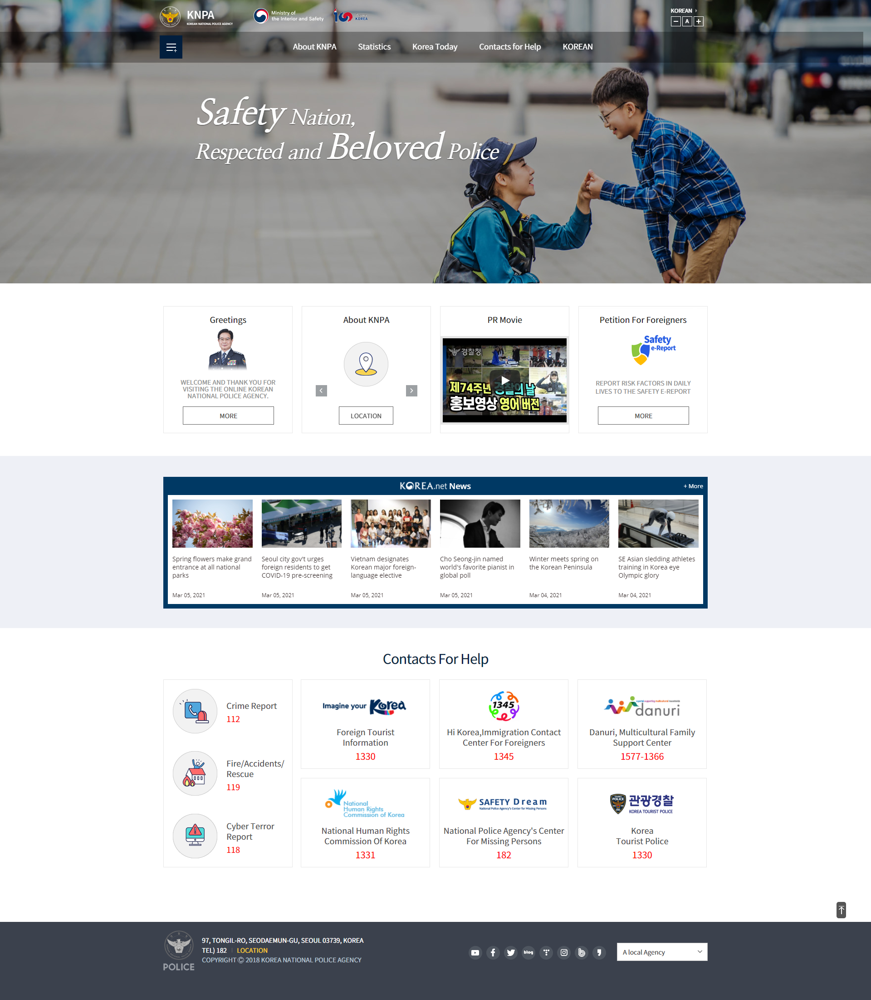

# police_agency_cloning
대한민국 경찰청 홈페이지를 클론 코딩한 프로젝트입니다.
처음 마크업&스타일링을 익히면서 웹표준에 맞게 코딩하였습니다.
이전 브라우저(IE8)에서도 레이아웃이 깨지지 않도록 만들었으며,
동적 요소는 Jquery로 구현하였습니다.

kakao map api를 사용하여 경찰청의 위치를 표시하는 지도를 삽입하였습니다.

* Keywords
  - HTML5 
  - CSS3 
  - Jquery
  - Kakao map api
  - 웹표준
   
* Supported Browsers
  - Chrome 
  - Firefox
  - IE 8~11 (In IE8, Javascript is not working)
  - ......

* Pages 
  - 1 main page
  - 8 sub pages : Including English page and Login page   
           
* Pages samples
------------------------------------------------------------------------------------
  main page    
    
------------------------------------------------------------------------------------
  sub page1    
    
------------------------------------------------------------------------------------
  sub page2    
    
------------------------------------------------------------------------------------
  sub page3    
    
------------------------------------------------------------------------------------
  sub page4     
    
------------------------------------------------------------------------------------
  sub page5    
    
------------------------------------------------------------------------------------
  sub page6    
    
------------------------------------------------------------------------------------
  sub page7    
    
------------------------------------------------------------------------------------
  

